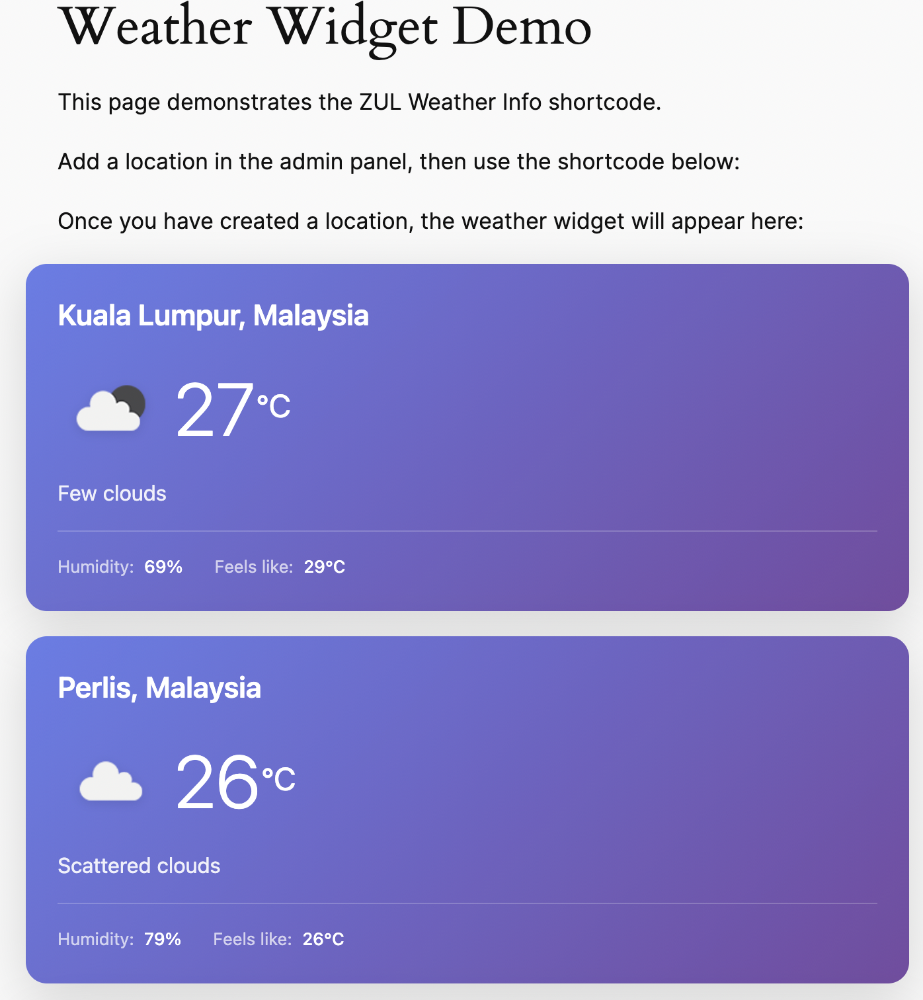
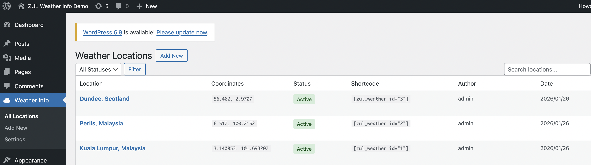
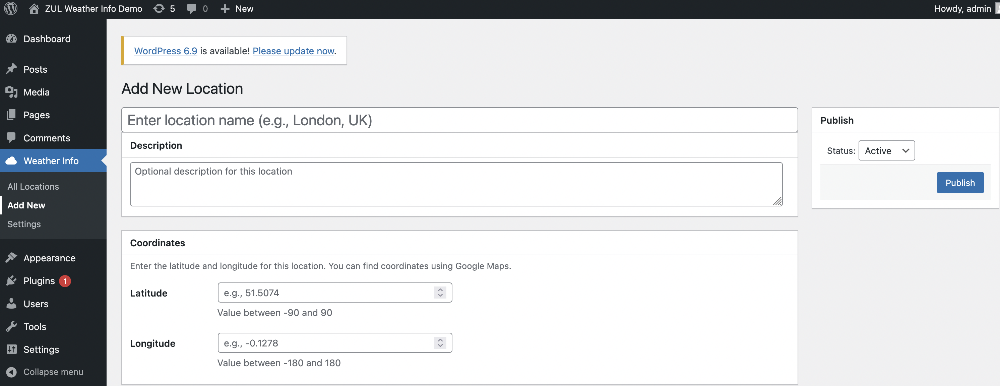

# ZUL Weather Info Plugin

A WordPress plugin that displays weather information for configured locations using the OpenWeatherMap API.

## Features

- **Admin Settings** - Configure OpenWeatherMap API key and cache duration
- **Location Management** - Add, edit, and manage weather locations with coordinates
- **Transient Caching** - Configurable cache duration to prevent API rate limiting
- **Mock Data Fallback** - Works without API key using demo data
- **Shortcode Display** - Easy frontend integration via `[zul_weather]` shortcode
- **Responsive Design** - Modern, mobile-friendly weather widget

## Screenshots

### Weather Widget (Frontend)


### Location Management


### Add/Edit Location


### API Settings


## Requirements

- WordPress 6.0 or higher
- PHP 8.0 or higher
- OpenWeatherMap API key (optional - uses mock data without it)

## Installation

### Manual Installation

1. Download or clone this repository
2. Upload the `zul-weatherinfo` folder to `/wp-content/plugins/`
3. Activate the plugin through the WordPress admin panel
4. Go to **Weather Info > Settings** to configure your API key

### Docker Installation (Development)

```bash
# Clone with submodules
git clone --recurse-submodules <repository-url>

# Or if already cloned, initialize submodules
git submodule update --init --recursive

# Start the Docker environment
./start.sh
```

#### Automatic Port Management

This project uses [zul-check-ports](https://github.com/thetycoon79/zul-check-ports) as a git submodule to automatically handle port conflicts. When you run `./start.sh`:

1. The port checker scans for available ports
2. If default ports are in use, it automatically finds alternatives
3. Assigned ports are saved to `.env.ports`
4. Docker Compose uses these dynamically assigned ports

```bash
# Example output when ports are in use:
Checking for available ports...

✓ WP: 8087 (default 8080 was in use)
✓ DB: 3310 (default 3307 was in use)
✓ PMA: 8088 (default 8081 was in use)

Port configuration saved to .env.ports
```

#### Default Ports

| Variable   | Default | Fallback Range | Description |
|------------|---------|----------------|-------------|
| `WP_PORT`  | 8080    | 8080-8199      | WordPress port |
| `DB_PORT`  | 3307    | 3307-3399      | MySQL port |
| `PMA_PORT` | 8081    | 8081-8199      | phpMyAdmin port |

## Configuration

### API Settings

1. Navigate to **Weather Info > Settings** in WordPress admin
2. Enter your OpenWeatherMap API key
   - Get a free key at [OpenWeatherMap](https://openweathermap.org/api)
   - The plugin uses the free Current Weather API 2.5
   - New API keys may take 1-2 hours to activate
3. Set cache duration (default: 10 minutes)

> **Note:** If no API key is configured, the plugin displays mock/demo data.

### Adding Locations

1. Go to **Weather Info > Add New**
2. Enter:
   - **Location Name** - e.g., "London, UK"
   - **Description** - Optional description
   - **Latitude** - Between -90 and 90 (e.g., 51.5074)
   - **Longitude** - Between -180 and 180 (e.g., -0.1278)
   - **Status** - Active or Inactive
3. Click **Publish**

> **Tip:** Find coordinates using [Google Maps](https://maps.google.com) - right-click on a location and select the coordinates.

## Usage

### Shortcode

Display weather for a location using the shortcode:

```
[zul_weather id="1"]
```

#### Shortcode Attributes

| Attribute | Default | Description |
|-----------|---------|-------------|
| `id` | (required) | Location ID |
| `class` | "" | Additional CSS class |
| `show_description` | "no" | Show location description |
| `show_humidity` | "yes" | Show humidity |
| `show_wind` | "no" | Show wind speed |

#### Examples

```
[zul_weather id="1"]
[zul_weather id="2" class="my-weather"]
[zul_weather id="1" show_wind="yes" show_humidity="yes"]
[zul_weather id="3" class="zul-weather-light"]
```

### CSS Classes

The widget supports two themes:
- Default gradient theme (purple/blue)
- Light theme - add class `zul-weather-light`

## Widget Output

The weather widget displays:
- Location name
- Current temperature (°C)
- Weather condition with icon
- Humidity percentage
- Feels like temperature
- Wind speed (optional)
- "Demo data" notice when using mock data

## Development

### Directory Structure

```
zul-weatherinfo/
├── zul-weather-info.php          # Main plugin file
├── uninstall.php                 # Cleanup on uninstall
├── start.sh                      # Docker environment starter
├── mock_response.json            # Fallback mock data
├── composer.json                 # PHP dependencies
├── phpunit.xml                   # Test configuration
├── docker-compose.yml            # Docker configuration
├── .env.ports                    # Generated port assignments (gitignored)
├── includes/
│   ├── Plugin.php                # Main orchestrator
│   ├── Activation.php            # Database setup
│   ├── Autoloader.php            # PSR-4 autoloader
│   ├── Capabilities.php          # Permission management
│   ├── Support/                  # Utilities (Db, Validator, Nonce)
│   ├── Domain/                   # Entities and Value Objects
│   ├── Interfaces/               # Repository & Client interfaces
│   ├── Repositories/             # Data access layer
│   ├── Api/                      # OpenWeatherMap client
│   ├── Cache/                    # Transient caching
│   ├── Services/                 # Business logic
│   ├── Admin/                    # Admin pages & controllers
│   ├── Assets/                   # Script/style management
│   └── Shortcode/                # Frontend shortcode
├── assets/
│   ├── css/                      # Stylesheets
│   └── js/                       # JavaScript
├── docker/
│   └── scripts/
│       └── check-ports.sh        # Port checker wrapper script
├── tools/
│   └── zul-check-ports/          # Git submodule for port management
└── tests/                        # PHPUnit tests
```

### Running Tests

```bash
# Using Docker
docker-compose run --rm --entrypoint "" phpunit vendor/bin/phpunit --testdox

# Using Make
make test
```

### Docker Commands

```bash
# Start environment
./start.sh

# Stop environment
docker-compose down

# View logs
docker-compose logs -f

# Run WP-CLI commands
docker-compose run --rm --entrypoint "" wpcli wp plugin list --allow-root

# Access phpMyAdmin (debug mode)
docker-compose --profile debug up -d phpmyadmin
```

### Make Commands

```bash
make start      # Start Docker environment
make stop       # Stop Docker environment
make test       # Run PHPUnit tests
make logs       # View container logs
make shell      # Open WordPress container shell
make clean      # Remove Docker volumes
```

### Git Submodules

This project uses [zul-check-ports](https://github.com/thetycoon79/zul-check-ports) as a git submodule for automatic port management.

#### Initial Setup

When cloning the repository, include submodules:

```bash
git clone --recurse-submodules <repository-url>
```

Or if you've already cloned without submodules:

```bash
git submodule update --init --recursive
```

#### Updating the Submodule

To update to the latest version of zul-check-ports:

```bash
cd tools/zul-check-ports
git pull origin main
cd ../..
git add tools/zul-check-ports
git commit -m "Update zul-check-ports submodule"
```

#### How Port Checking Works

The `docker/scripts/check-ports.sh` wrapper script:

1. Calls the `zul-check-ports` tool with project-specific port configurations
2. Checks if default ports (8080, 3307, 8081) are available
3. If a port is in use, finds the next available port in the fallback range
4. Writes assigned ports to `.env.ports` file
5. `start.sh` sources this file and exports variables for docker-compose

```bash
# Manual port check (without starting Docker)
./docker/scripts/check-ports.sh

# View assigned ports
cat .env.ports
```

#### Customizing Port Ranges

Edit `docker/scripts/check-ports.sh` to modify port specifications:

```bash
# Format: NAME:DEFAULT:RANGE_START:RANGE_END
WP:8080:8080:8199      # WordPress: try 8080, fallback to 8080-8199
DB:3307:3307:3399      # MySQL: try 3307, fallback to 3307-3399
PMA:8081:8081:8199     # phpMyAdmin: try 8081, fallback to 8081-8199
```

## Database

The plugin creates a custom table `wp_zul_weather_info`:

| Column | Type | Description |
|--------|------|-------------|
| id | BIGINT | Primary key |
| location | VARCHAR(255) | Location name |
| description | TEXT | Optional description |
| latitude | DECIMAL(10,7) | Latitude coordinate |
| longitude | DECIMAL(10,7) | Longitude coordinate |
| created_by | BIGINT | WordPress user ID |
| status | VARCHAR(50) | active/inactive |
| create_dt | DATETIME | Created timestamp |
| modified_dt | DATETIME | Modified timestamp |

## WordPress Options

| Option | Default | Description |
|--------|---------|-------------|
| `zul_weather_api_key` | "" | OpenWeatherMap API key |
| `zul_weather_cache_minutes` | 10 | Cache TTL in minutes |

## Capabilities

| Capability | Description |
|------------|-------------|
| `zul_weather_manage` | Create, edit, delete locations |
| `zul_weather_view_admin` | View admin pages |

Both capabilities are granted to the Administrator role on activation.

## API Reference

### OpenWeatherMap Current Weather API 2.5 (Free Tier)

Endpoint:
```
https://api.openweathermap.org/data/2.5/weather?lat={lat}&lon={lon}&appid={key}&units=metric
```

> **Note:** This plugin uses the free Current Weather API 2.5, which is included with any OpenWeatherMap API key. New API keys may take 1-2 hours to activate after registration.

The plugin fetches current weather data including:
- Temperature
- Feels like temperature
- Humidity
- Pressure
- Wind speed
- Weather condition and icon

## Error Handling

| Scenario | Behavior |
|----------|----------|
| No API key | Uses mock_response.json, shows "Demo data" notice |
| API timeout | Shows "Weather data unavailable" |
| Invalid API key | Shows "Weather data unavailable" |
| Location not found | Shows nothing (errors visible to admins only) |
| Inactive location | Shows nothing |

## Security

- All admin actions require nonce verification
- Capability checks on all admin endpoints
- All SQL queries use `$wpdb->prepare()`
- Input sanitization with WordPress functions
- Output escaping with `esc_html()`, `esc_attr()`

## Changelog

### 1.0.0
- Initial release
- Admin settings page with API key and cache configuration
- Location management with CRUD operations
- OpenWeatherMap One Call API 3.0 integration
- Transient-based caching
- Mock response fallback
- `[zul_weather]` shortcode
- PHPUnit test suite
- Docker development environment

## License

GPL-2.0-or-later

See [DISCLAIMER.md](DISCLAIMER.md) for warranty information and third-party service details.

## Credits

- Weather data provided by [OpenWeatherMap](https://openweathermap.org/)
- Weather icons from OpenWeatherMap
